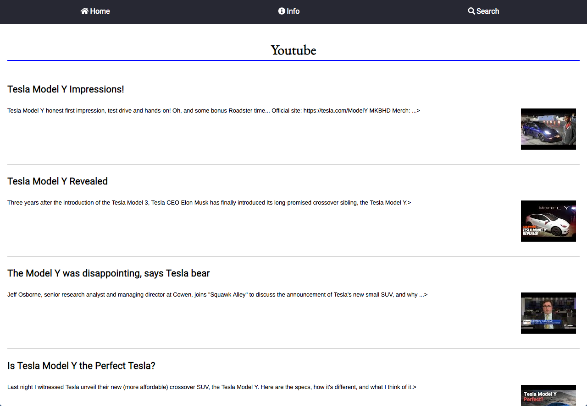

# Bias Checker

In today's age, where there is an insane amount of information and data at our fingertips, it's hard to decide what to read or believe. With Bias Checker, users can search for any topic that interests them and read articles written by both sides of the political spectrum. With that knowledge, they can then decide how best to interpret the information given to them.

## Demo

- Live Preview can be found at : https://edweezu.github.io/news-comparison-api-capstone/

## Screenshots
Login Screen/Landing Page:

Political Spectrum Info:

News Search Section: 

Youtube Video Section:

User Flows and WireFrame: 

## Technologies Used
  - HTML5
  - CSS3
  - Javascript
  - jQuery
  - 3rd Party API's: NewsAPI, YoutubeAPI

